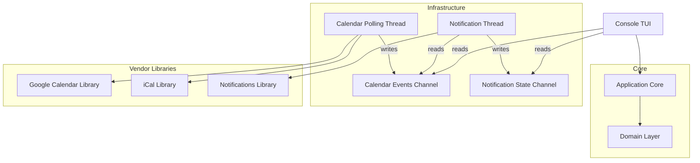

# Design Document: Meeting Reminder TUI

## Overview

The Meeting Reminder TUI is a C# console application that provides aggressive, escalating notifications for calendar meetings. The system follows Clean Architecture principles with vertical slice organization, using the Result pattern for error handling and a pub/sub model for thread communication.

The application follows Clean Architecture with these layers:
- **Presentation Layer**: Spectre.Console-based TUI (with abstraction for future GUI support)
- **Application Layer**: Use cases organized as vertical slices, each containing its own command/query, handler, and validation
- **Domain Layer**: Core business entities, value objects, and domain logic
- **Infrastructure Layer**: Vendor-specific implementations (Google Calendar, iCal, notification strategies)

Key design principles:
- **Clean Architecture**: Dependencies point inward; domain has no external dependencies
- **Vertical Slices**: Features organized by use case rather than technical layer
- **Result Pattern**: All operations return `Result<T>` or `Result<T, TError>` instead of throwing exceptions
- **No Nulls**: Avoid nullable types where possible; use Result pattern to represent absence of values
- **Structured Errors**: Error objects with codes, messages, and context instead of exceptions
- **Thread Safety**: Polling and notification on separate threads with channel-based communication
- **Modularity**: Core library with vendor-specific logic in separate projects
- **Extensibility**: Interface-based design allows for future implementations
- **UTC Time Throughout**: All DateTime values in Domain, Application, and Infrastructure layers MUST use UTC. Local time conversion happens ONLY in the UI layer when displaying to users.

## Architecture

### Project Structure

```
MeetingReminderTui/
├── MeetingReminderTui.Domain/           # Core domain entities and logic
│   ├── Entities/
│   ├── ValueObjects/
│   ├── Events/
│   └── Errors/
├── MeetingReminderTui.Application/      # Use cases and application logic
│   ├── UseCases/
│   │   ├── FetchCalendarEvents/
│   │   ├── CalculateNotifications/
│   │   ├── AcknowledgeMeeting/
│   │   └── ExtractMeetingLink/
│   ├── Abstractions/
│   └── Common/
├── MeetingReminderTui.Infrastructure/   # Cross-cutting infrastructure
│   ├── Configuration/
│   ├── Logging/
│   └── Threading/
├── MeetingReminderTui.GoogleCalendar/   # Google Calendar integration
├── MeetingReminderTui.ICal/             # iCal integration
├── MeetingReminderTui.Notifications/    # Notification strategies
│   ├── Beep/
│   ├── Flash/
│   ├── Sound/
│   └── SystemNotification/
└── MeetingReminderTui.Console/          # Spectre.Console TUI
    └── Program.cs
```

### High-Level Component Diagram



### Threading Model

The application uses three primary threads communicating via `System.Threading.Channels`:

1. **Main Thread (UI Thread)**:
   - Runs Spectre.Console TUI
   - Handles user input
   - Reads from calendar and notification channels
   - Updates display based on channel messages

2. **Calendar Polling Thread**:
   - Polls calendar sources at configured interval
   - Writes `CalendarEventsUpdated` messages to calendar channel
   - Runs independently, never blocks UI

3. **Notification Thread**:
   - Reads from calendar channel
   - Calculates notification levels
   - Executes notification strategies
   - Writes `NotificationStateChanged` messages to notification channel

**Channel-Based Communication**:
```csharp
// Channels are created at startup in Program.cs
var calendarChannel = Channel.CreateUnbounded<CalendarEventsUpdated>();
var notificationChannel = Channel.CreateUnbounded<NotificationStateChanged>();

// Calendar thread writes
await calendarChannel.Writer.WriteAsync(new CalendarEventsUpdated(...));

// Notification thread reads
await foreach (var update in calendarChannel.Reader.ReadAllAsync(cancellationToken))
{
    ProcessCalendarUpdate(update);
}

// UI thread reads (non-blocking)
if (calendarChannel.Reader.TryRead(out var update))
{
    UpdateDisplay(update);
}
```

**Message Types** (immutable records):
```csharp
public record CalendarEventsUpdated(
    IReadOnlyList<MeetingEvent> AllEvents,
    IReadOnlyList<MeetingEvent> AddedEvents,
    IReadOnlyList<string> RemovedEventIds,
    DateTime OccurredAt);

public record NotificationStateChanged(
    IReadOnlyList<MeetingState> ActiveNotifications,
    DateTime OccurredAt);

public record MeetingAcknowledged(
    string MeetingId,
    DateTime AcknowledgedAt);
```

### Layer Responsibilities

**Domain Layer** (no external dependencies):
- `MeetingEvent`: Core entity representing a calendar meeting
- `MeetingLink`: Value object for meeting URLs
- `NotificationLevel`: Enum for urgency levels
- `MeetingState`: Entity tracking notification state
- Message types: `CalendarEventsUpdated`, `NotificationStateChanged`, etc.
- Domain errors: `CalendarError`, `NotificationError`, `ConfigurationError`

**Application Layer** (depends only on Domain):
- Use cases organized as vertical slices
- Each use case has: Command/Query, Handler, Validator
- Returns `Result<T>` or `Result<T, TError>` from all operations
- Defines abstractions (interfaces) for infrastructure

**Infrastructure Layer**:
- Implements application abstractions
- Configuration management
- Channel setup and management
- Logging infrastructure
- No business logic

**Vendor-Specific Libraries** (separate projects):
- Google Calendar integration
- iCal parsing
- Notification strategies
- Each implements interfaces from Application layer
- Can be swapped or extended independently

## Components and Interfaces

### Result Pattern

All operations return `Result<T, TError>` instead of throwing exceptions. The Result type is a discriminated union (Either monad) that represents success or failure.

**Key Features**:
- Implicit conversion operators allow natural syntax: `return value;` or `return error;`
- Match/Switch methods for exhaustive handling
- Monadic operations: `Bind`, `Map`, `MapError`, `And`, `Or`
- Fluent error handling with `OnSuccess`, `OnError`

```csharp
// Result is a readonly record struct with implicit conversions
public readonly record struct Result<T, TE1>
{
    public bool IsSuccess { get; }
    public bool IsError { get; }
    public bool IsValid { get; }
    
    // Implicit conversions enable clean syntax
    public static implicit operator Result<T, TE1>(T value);
    public static implicit operator Result<T, TE1>(TE1 error);
    
    // Pattern matching
    public TOut Match<TOut>(Func<T, TOut> onSuccess, Func<TE1, TOut> onError);
    public void Switch(Action<T> onSuccess, Action<TE1> onError);
    
    // Monadic operations
    public Result<TOut, TE1> Bind<TOut>(Func<T, Result<TOut, TE1>> func);
    public Result<TOut, TE1> Map<TOut>(Func<T, TOut> map);
    public Result<T, TErrorOut> MapError<TErrorOut>(Func<TE1, TErrorOut> map);
    public Result<TOut, TE1> And<TOut>(Func<T, Result<TOut, TE1>> func);
    public Result<T, TError2> Or<TError2>(Func<TE1, Result<T, TError2>> func);
    
    // Side effects
    public Result<T, TE1> OnSuccess(Action<T> onSuccess);
    public Result<T, TE1> OnError(Action<TE1> onError);
}

// Factory methods
public static class Result
{
    public static Result<T, TE1> FromValue<T, TE1>(T value);
    public static Result<T, TE1> FromError<T, TE1>(TE1 error);
    public static Result<T, Exception> Try<T>(Func<T> function);
}
```

**Usage Example**:
```csharp
// Implicit conversion from value
public Result<MeetingEvent, CalendarError> GetMeeting(string id)
{
    if (string.IsNullOrEmpty(id))
        return new CalendarError("Meeting ID is required");
    
    var meeting = FindMeeting(id);
    return meeting; // Implicit conversion from MeetingEvent
}

// Monadic chaining
var result = GetMeeting(id)
    .Map(meeting => meeting.Title)
    .OnError(error => Log(error));
```

### Error Types

The base `Error` type captures the error message and stack trace for debugging:

```csharp
// Base error type - all errors inherit from this
public abstract record Error(string Message, string StackTrace)
{
    public Error(string message) 
        : this(message, GetCurrentStackTrace()) { }
}

// Built-in error types
public sealed record AggregateError(IReadOnlyList<Error> Errors) : Error(...);
public sealed record UnknownException(Exception Exception) : Error(...);
public sealed record UnknownError(string Message) : Error(...);
```

**Domain-Specific Errors** (to be implemented in task 2.2):
```csharp
public sealed record CalendarError(
    string Message,
    string? CalendarSource = null,
    Exception? InnerException = null) : Error(Message);

public sealed record NotificationError(
    string Message,
    string? StrategyName = null) : Error(Message);

public sealed record ConfigurationError(
    string Message,
    string? ConfigKey = null) : Error(Message);
```

### Assert Pattern

The `Assert` class provides defensive guard clauses with automatic parameter name capture:

```csharp
public static class Assert
{
    public static T NotNull<T>(T? value, [CallerArgumentExpression] string? name = null);
    public static string NotNullOrEmpty(string value, [CallerArgumentExpression] string? name = null);
    public static int NotZeroOrNegative(int value, [CallerArgumentExpression] string? name = null);
    public static int InRange(int value, int min, int max, [CallerArgumentExpression] string? name = null);
    public static int NotNegative(int value, [CallerArgumentExpression] string? name = null);
}
```

**Usage Pattern**:
```csharp
using static MeetingReminder.Domain.Assert;

public class MeetingEvent
{
    public MeetingEvent(string id, string title)
    {
        Id = NotNullOrEmpty(id);
        Title = NotNullOrEmpty(title);
    }
}
```

Note: Use `using static MeetingReminder.Domain.Assert;` at the top of files to avoid qualifying every method call.

### Domain Layer

**Core Entities**:

```csharp
// Represents a calendar meeting event
public class MeetingEvent
{
    public string Id { get; init; }
    public string Title { get; init; }
    public DateTime StartTime { get; init; }
    public DateTime EndTime { get; init; }
    public string Description { get; init; }
    public string Location { get; init; }
    public bool IsAllDay { get; init; }
    public string CalendarSource { get; init; }
    public MeetingLink? Link { get; init; }
    
    // Domain logic
    public TimeSpan GetTimeUntilStart(DateTime currentTime) 
        => StartTime - currentTime;
    
    public bool IsInProgress(DateTime currentTime)
        => currentTime >= StartTime && currentTime < EndTime;
}

// Value object for meeting links
public record MeetingLink(string Url, MeetingLinkType Type);

public enum MeetingLinkType
{
    GoogleMeet,
    Zoom,
    MicrosoftTeams,
    Other
}

// Represents notification urgency level
public enum NotificationLevel
{
    None,      // No notification
    Gentle,    // Early warning
    Moderate,  // Getting closer
    Urgent,    // Very close
    Critical   // At or past meeting time
}

// Entity tracking meeting notification state
public class MeetingState
{
    public MeetingEvent Event { get; init; }
    public NotificationLevel CurrentLevel { get; private set; }
    public bool IsAcknowledged { get; private set; }
    public DateTime LastNotificationTime { get; private set; }
    
    /// <summary>
    /// Updates the notification level. Only allows escalation.
    /// </summary>
    /// <returns>True if the level actually changed (escalated), false otherwise</returns>
    public bool UpdateNotificationLevel(NotificationLevel level)
    {
        if (level > CurrentLevel) // Only allow escalation
        {
            CurrentLevel = level;
            return true;
        }
        return false;
    }
    
    public void Acknowledge()
    {
        IsAcknowledged = true;
        CurrentLevel = NotificationLevel.None;
    }
}
```

**Domain Events**:

```csharp
// Message types for channel communication
// These are immutable records but don't need to inherit from a base type
public record CalendarEventsUpdated(
    IReadOnlyList<MeetingEvent> AllEvents,
    IReadOnlyList<MeetingEvent> AddedEvents,
    IReadOnlyList<string> RemovedEventIds,
    DateTime OccurredAt);

public record NotificationStateChanged(
    IReadOnlyList<MeetingState> ActiveNotifications,
    DateTime OccurredAt);

public record MeetingAcknowledged(
    string MeetingId,
    bool LinkOpened,
    DateTime OccurredAt);
```

### Application Layer - Use Cases

**Use Case: Fetch Calendar Events**

```csharp
// Query
public record FetchCalendarEventsQuery(
    DateTime StartTime,
    DateTime EndTime);

// Handler
public class FetchCalendarEventsHandler
{
    private readonly IEnumerable<ICalendarSource> _sources;
    
    public async Task<Result<IReadOnlyList<MeetingEvent>, CalendarError>> 
        HandleAsync(FetchCalendarEventsQuery query, CancellationToken ct)
    {
        var allEvents = new List<MeetingEvent>();
        var errors = new List<CalendarError>();
        
        foreach (var source in _sources)
        {
            var result = await source.FetchEventsAsync(
                query.StartTime, 
                query.EndTime, 
                ct);
            
            if (result.IsSuccess)
                allEvents.AddRange(result.Value);
            else
                errors.Add(result.Error);
        }
        
        // Succeed if at least one source worked
        if (allEvents.Any())
            return Result<IReadOnlyList<MeetingEvent>, CalendarError>
                .Success(allEvents.AsReadOnly());
        
        // All sources failed
        return Result<IReadOnlyList<MeetingEvent>, CalendarError>
            .Failure(new CalendarError(
                "CALENDAR_ALL_SOURCES_FAILED",
                "All calendar sources failed to fetch events",
                Context: new() { ["ErrorCount"] = errors.Count }));
    }
}
```

**Use Case: Calculate Notification Level**

```csharp
// Query
public record CalculateNotificationLevelQuery(
    MeetingEvent Meeting,
    DateTime CurrentTime,
    CalendarNotificationRules Rules);

// Handler
public class CalculateNotificationLevelHandler
{
    private readonly NotificationThresholds _thresholds;
    
    public Result<NotificationLevel> Handle(
        CalculateNotificationLevelQuery query)
    {
        var meeting = query.Meeting;
        var currentTime = query.CurrentTime;
        var rules = query.Rules;
        
        // All-day events never escalate beyond Gentle
        if (meeting.IsAllDay)
            return Result<NotificationLevel>.Success(NotificationLevel.Gentle);
        
        // Check if current time is within notification window
        if (!rules.IsWithinNotificationWindow(currentTime))
            return Result<NotificationLevel>.Success(NotificationLevel.None);
        
        var timeUntilStart = meeting.GetTimeUntilStart(currentTime);
        
        var level = timeUntilStart switch
        {
            <= TimeSpan.Zero => NotificationLevel.Critical,
            var t when t <= _thresholds.UrgentMinutes => NotificationLevel.Urgent,
            var t when t <= _thresholds.ModerateMinutes => NotificationLevel.Moderate,
            var t when t <= _thresholds.GentleMinutes => NotificationLevel.Gentle,
            _ => NotificationLevel.None
        };
        
        return Result<NotificationLevel>.Success(level);
    }
}
```

**Use Case: Acknowledge Meeting**

```csharp
// Command
public record AcknowledgeMeetingCommand(
    string MeetingId,
    bool OpenLink);

// Handler
public class AcknowledgeMeetingHandler
{
    private readonly ChannelWriter<MeetingAcknowledged> _acknowledgementChannel;
    private readonly IBrowserLauncher _browserLauncher;
    private readonly IMeetingRepository _meetingRepository;
    
    public async Task<Result<Unit, NotificationError>> HandleAsync(
        AcknowledgeMeetingCommand command)
    {
        // Get meeting state
        var meetingResult = await _meetingRepository
            .GetByIdAsync(command.MeetingId);
        
        if (meetingResult.IsFailure)
            return Result<Unit, NotificationError>.Failure(
                new NotificationError(
                    "MEETING_NOT_FOUND",
                    $"Meeting {command.MeetingId} not found"));
        
        var meetingState = meetingResult.Value;
        
        // Open link if requested
        if (command.OpenLink && meetingState.Event.Link != null)
        {
            var launchResult = _browserLauncher
                .OpenUrl(meetingState.Event.Link.Url);
            
            if (launchResult.IsFailure)
                return Result<Unit, NotificationError>.Failure(
                    new NotificationError(
                        "BROWSER_LAUNCH_FAILED",
                        "Failed to open meeting link",
                        Context: new() { ["Url"] = meetingState.Event.Link.Url }));
        }
        
        // Acknowledge meeting
        meetingState.Acknowledge();
        await _meetingRepository.UpdateAsync(meetingState);
        
        // Write to channel
        await _acknowledgementChannel.WriteAsync(new MeetingAcknowledged(
            command.MeetingId,
            command.OpenLink,
            DateTime.UtcNow));
        
        return Result<Unit, NotificationError>.Success(Unit.Value);
    }
}

// Unit type for void results
public struct Unit
{
    public static Unit Value => default;
}
```

**Use Case: Extract Meeting Link**

```csharp
// Query
public record ExtractMeetingLinkQuery(string? Description, string? Location);

// Handler
public class ExtractMeetingLinkHandler
{
    private static readonly Dictionary<MeetingLinkType, Regex> LinkPatterns = new()
    {
        [MeetingLinkType.GoogleMeet] = new Regex(
            @"https?://meet\.google\.com/[a-z\-]+",
            RegexOptions.IgnoreCase),
        [MeetingLinkType.Zoom] = new Regex(
            @"https?://(?:[\w-]+\.)?zoom\.us/(?:j|my)/[\w?=&]+",
            RegexOptions.IgnoreCase),
        [MeetingLinkType.MicrosoftTeams] = new Regex(
            @"https?://teams\.microsoft\.com/l/meetup-join/[^\s]+",
            RegexOptions.IgnoreCase)
    };
    
    public Result<MeetingLink, Error> Extract(ExtractMeetingLinkQuery query)
    {
        var searchText = $"{query.Description ?? ""} {query.Location ?? ""}";
        
        if (string.IsNullOrWhiteSpace(searchText))
            return MeetingLinkError.NoLinkFound();
        
        // Try to match video conferencing links first
        foreach (var (type, pattern) in LinkPatterns)
        {
            var match = pattern.Match(searchText);
            if (match.Success)
                return new MeetingLink(match.Value, type);
        }
        
        // Try to match any URL as fallback
        var genericUrlPattern = new Regex(
            @"https?://[^\s]+",
            RegexOptions.IgnoreCase);
        
        var genericMatch = genericUrlPattern.Match(searchText);
        if (genericMatch.Success)
            return new MeetingLink(genericMatch.Value, MeetingLinkType.Other);
        
        // No link found - return error instead of null
        return MeetingLinkError.NoLinkFound();
    }
}
```

### Application Layer - Abstractions

```csharp
// Calendar source abstraction
public interface ICalendarSource
{
    Task<Result<IReadOnlyList<MeetingEvent>, CalendarError>> 
        FetchEventsAsync(
            DateTime startTime,
            DateTime endTime,
            CancellationToken cancellationToken);
    
    string SourceName { get; }
}

// Notification strategy abstraction
// Strategies support two trigger modes: per-cycle (for persistent reminders like beeps)
// and on-level-change (for one-time notifications like toasts)
public interface INotificationStrategy
{
    /// <summary>
    /// Executes on every notification processing cycle.
    /// Use for persistent reminders (beeps, sounds).
    /// Return success with no action if this strategy doesn't need per-cycle execution.
    /// </summary>
    Task<Result<Unit, NotificationError>> ExecuteOnCycleAsync(
        NotificationLevel level,
        MeetingEvent meeting);
    
    /// <summary>
    /// Executes only when notification level escalates (None→Gentle→Moderate→Urgent→Critical).
    /// Use for one-time notifications (toasts, system notifications, terminal flash).
    /// Return success with no action if this strategy doesn't need level-change execution.
    /// </summary>
    Task<Result<Unit, NotificationError>> ExecuteOnLevelChangeAsync(
        NotificationLevel previousLevel,
        NotificationLevel newLevel,
        MeetingEvent meeting);
    
    string StrategyName { get; }
    bool IsSupported { get; }
}

// Browser launcher abstraction
public interface IBrowserLauncher
{
    Result<Unit, Error> OpenUrl(string url);
}

// Meeting repository abstraction
public interface IMeetingRepository
{
    Task<Result<MeetingState, Error>> GetByIdAsync(string id);
    Task<Result<IReadOnlyList<MeetingState>, Error>> GetAllAsync();
    Task<Result<Unit, Error>> UpdateAsync(MeetingState state);
}
```

## Data Models

### Configuration Models

```csharp
// Configuration model
public record AppConfiguration(
    TimeSpan PollingInterval,
    List<string> EnabledNotificationStrategies,
    NotificationThresholds Thresholds,
    List<CalendarConfiguration> Calendars)
{
    // Default configuration
    public static AppConfiguration Default => new(
        PollingInterval: TimeSpan.FromMinutes(5),
        EnabledNotificationStrategies: new() { "Beep", "SystemNotification" },
        Thresholds: NotificationThresholds.Default,
        Calendars: new());
}

public record NotificationThresholds(
    TimeSpan GentleMinutes,
    TimeSpan ModerateMinutes,
    TimeSpan UrgentMinutes)
{
    public static NotificationThresholds Default => new(
        GentleMinutes: TimeSpan.FromMinutes(10),
        ModerateMinutes: TimeSpan.FromMinutes(5),
        UrgentMinutes: TimeSpan.FromMinutes(1));
}

public record CalendarConfiguration(
    string Name,
    CalendarType Type,
    string? SourceUrl,
    CalendarNotificationRules NotificationRules);

public enum CalendarType
{
    GoogleCalendar,
    ICal
}

public record CalendarNotificationRules(
    TimeSpan? NotificationWindowStart,
    TimeSpan? NotificationWindowEnd,
    int UrgencyMultiplier)
{
    public bool IsWithinNotificationWindow(DateTime currentTime)
    {
        if (NotificationWindowStart == null || NotificationWindowEnd == null)
            return true;
        
        var timeOfDay = currentTime.TimeOfDay;
        return timeOfDay >= NotificationWindowStart && 
               timeOfDay <= NotificationWindowEnd;
    }
    
    public static CalendarNotificationRules Default => new(
        NotificationWindowStart: null,
        NotificationWindowEnd: null,
        UrgencyMultiplier: 1);
}
```

### Infrastructure - Calendar Polling Service

```csharp
public class CalendarPollingService : IDisposable
{
    private readonly IEnumerable<ICalendarSource> _sources;
    private readonly ChannelWriter<CalendarEventsUpdated> _calendarChannel;
    private readonly AppConfiguration _config;
    private readonly Timer _timer;
    private readonly SemaphoreSlim _pollLock = new(1, 1);
    private Dictionary<string, MeetingEvent> _lastKnownEvents = new();
    
    public CalendarPollingService(
        IEnumerable<ICalendarSource> sources,
        ChannelWriter<CalendarEventsUpdated> calendarChannel,
        AppConfiguration config)
    {
        _sources = sources;
        _calendarChannel = calendarChannel;
        _config = config;
        _timer = new Timer(
            _ => _ = PollAsync(),
            null,
            TimeSpan.Zero,
            config.PollingInterval);
    }
    
    private async Task PollAsync()
    {
        if (!await _pollLock.WaitAsync(0))
            return; // Skip if previous poll still running
        
        try
        {
            var query = new FetchCalendarEventsQuery(
                DateTime.Now,
                DateTime.Now.AddDays(7));
            
            var handler = new FetchCalendarEventsHandler(_sources);
            var result = await handler.HandleAsync(query, CancellationToken.None);
            
            if (result.IsSuccess)
            {
                var currentEvents = result.Value
                    .ToDictionary(e => e.Id, e => e);
                
                // Detect changes
                var added = currentEvents.Values
                    .Where(e => !_lastKnownEvents.ContainsKey(e.Id))
                    .ToList();
                
                var removed = _lastKnownEvents.Keys
                    .Where(id => !currentEvents.ContainsKey(id))
                    .ToList();
                
                // Write to channel
                await _calendarChannel.WriteAsync(new CalendarEventsUpdated(
                    currentEvents.Values.ToList().AsReadOnly(),
                    added.AsReadOnly(),
                    removed.AsReadOnly(),
                    DateTime.UtcNow));
                
                _lastKnownEvents = currentEvents;
            }
        }
        finally
        {
            _pollLock.Release();
        }
    }
    
    public void Dispose()
    {
        _timer?.Dispose();
        _pollLock?.Dispose();
    }
}
```

### Infrastructure - Notification Processing Service

```csharp
public class NotificationProcessingService : IDisposable
{
    private readonly ChannelReader<CalendarEventsUpdated> _calendarChannel;
    private readonly ChannelWriter<NotificationStateChanged> _notificationChannel;
    private readonly IEnumerable<INotificationStrategy> _strategies;
    private readonly AppConfiguration _config;
    private readonly Dictionary<string, MeetingState> _meetingStates = new();
    private readonly Timer _notificationTimer;
    private readonly CancellationTokenSource _cts = new();
    
    public NotificationProcessingService(
        ChannelReader<CalendarEventsUpdated> calendarChannel,
        ChannelWriter<NotificationStateChanged> notificationChannel,
        IEnumerable<INotificationStrategy> strategies,
        AppConfiguration config)
    {
        _calendarChannel = calendarChannel;
        _notificationChannel = notificationChannel;
        _strategies = strategies.Where(s => 
            config.EnabledNotificationStrategies.Contains(s.StrategyName) && 
            s.IsSupported);
        _config = config;
        
        // Start reading from calendar channel
        _ = Task.Run(ReadCalendarUpdatesAsync);
        
        // Process notifications every 10 seconds
        _notificationTimer = new Timer(
            _ => ProcessNotifications(),
            null,
            TimeSpan.FromSeconds(10),
            TimeSpan.FromSeconds(10));
    }
    
    private async Task ReadCalendarUpdatesAsync()
    {
        await foreach (var update in _calendarChannel.ReadAllAsync(_cts.Token))
        {
            OnCalendarUpdated(update);
        }
    }
    
    private void OnCalendarUpdated(CalendarEventsUpdated update)
    {
        // Remove acknowledged or deleted meetings
        foreach (var removedId in update.RemovedEventIds)
            _meetingStates.Remove(removedId);
        
        // Add or update meeting states
        foreach (var meeting in update.AllEvents)
        {
            if (!_meetingStates.ContainsKey(meeting.Id))
            {
                _meetingStates[meeting.Id] = new MeetingState
                {
                    Event = meeting,
                    CurrentLevel = NotificationLevel.None,
                    IsAcknowledged = false,
                    LastNotificationTime = DateTime.MinValue
                };
            }
            else
            {
                // Update event data but preserve state
                _meetingStates[meeting.Id] = _meetingStates[meeting.Id] with
                {
                    Event = meeting
                };
            }
        }
    }
    
    private void ProcessNotifications()
    {
        var currentTime = DateTime.Now;
        var handler = new CalculateNotificationLevelHandler(_config.Thresholds);
        var activeNotifications = new List<MeetingState>();
        
        foreach (var state in _meetingStates.Values.Where(s => !s.IsAcknowledged))
        {
            var calendarConfig = _config.Calendars
                .FirstOrDefault(c => c.Name == state.Event.CalendarSource);
            
            var rules = calendarConfig?.NotificationRules 
                ?? CalendarNotificationRules.Default;
            
            var query = new CalculateNotificationLevelQuery(
                state.Event,
                currentTime,
                rules);
            
            var result = handler.Handle(query);
            
            if (result.IsSuccess && result.Value != NotificationLevel.None)
            {
                var previousLevel = state.CurrentLevel;
                var levelChanged = state.UpdateNotificationLevel(result.Value);
                
                // Execute notification strategies with appropriate trigger modes
                foreach (var strategy in _strategies)
                {
                    // Always execute per-cycle notifications (beeps, sounds)
                    _ = strategy.ExecuteOnCycleAsync(state.CurrentLevel, state.Event);
                    
                    // Only execute level-change notifications when level actually escalated
                    if (levelChanged)
                    {
                        _ = strategy.ExecuteOnLevelChangeAsync(
                            previousLevel, state.CurrentLevel, state.Event);
                    }
                }
                
                state.LastNotificationTime = currentTime;
                activeNotifications.Add(state);
            }
        }
        
        // Write notification state update to channel
        if (activeNotifications.Any())
        {
            _notificationChannel.TryWrite(new NotificationStateChanged(
                activeNotifications.AsReadOnly(),
                DateTime.UtcNow));
        }
    }
    
    public void Dispose()
    {
        _cts.Cancel();
        _notificationTimer?.Dispose();
    }
}
```

### Meeting Event Lifecycle

```
┌─────────────┐
│  Fetched    │  Calendar poller retrieves event
└──────┬──────┘
       │
       v
┌─────────────┐
│  Upcoming   │  Event is in the future, no notifications yet
└──────┬──────┘
       │
       v
┌─────────────┐
│  Notifying  │  Event is within notification threshold
└──────┬──────┘
       │
       v
┌─────────────┐
│ Acknowledged│  User has acknowledged the meeting
└─────────────┘
```

### Data Flow

```
Calendar Sources → Polling Service → Calendar Channel → Notification Service
                                   ↓                    ↓
                              UI Reader            Notification Channel
                                                        ↓
                                                   UI Reader
```

### Urgency Ordering Algorithm

When multiple meetings are imminent, they are ordered by:
1. **Notification Level** (Critical > Urgent > Moderate > Gentle)
2. **Time Until Start** (sooner meetings first)
3. **Calendar Priority** (per-calendar urgency multiplier)

```csharp
public class MeetingUrgencyComparer : IComparer<MeetingState>
{
    private readonly AppConfiguration _config;
    
    public int Compare(MeetingState x, MeetingState y)
    {
        // First compare by notification level
        var levelComparison = y.CurrentLevel.CompareTo(x.CurrentLevel);
        if (levelComparison != 0)
            return levelComparison;
        
        // Then by time until start (sooner first)
        var timeComparison = x.Event.StartTime.CompareTo(y.Event.StartTime);
        if (timeComparison != 0)
            return timeComparison;
        
        // Finally by calendar priority
        var xPriority = GetCalendarPriority(x.Event.CalendarSource);
        var yPriority = GetCalendarPriority(y.Event.CalendarSource);
        return yPriority.CompareTo(xPriority);
    }
    
    private int GetCalendarPriority(string calendarSource)
    {
        var calendar = _config.Calendars
            .FirstOrDefault(c => c.Name == calendarSource);
        return calendar?.NotificationRules.UrgencyMultiplier ?? 1;
    }
}
```


## Correctness Properties

A property is a characteristic or behavior that should hold true across all valid executions of a system—essentially, a formal statement about what the system should do. Properties serve as the bridge between human-readable specifications and machine-verifiable correctness guarantees.

### Property 1: Chronological Meeting Order

*For any* list of meetings, when displayed in the TUI, they should be ordered chronologically by start time (earliest first).

**Validates: Requirements 1.2**

### Property 2: Meeting Display Contains Required Information

*For any* meeting displayed in the list view, the rendered output should contain both the meeting title and start time.

**Validates: Requirements 1.3**

### Property 3: UI Reflects Calendar Data Changes

*For any* change to the calendar data (meetings added, removed, or modified), the TUI should update to reflect the new state within one refresh cycle.

**Validates: Requirements 1.4, 2.5, 7.5**

### Property 4: Meeting Details Contain All Required Fields

*For any* meeting displayed in the detail view, the rendered output should contain title, start time, end time, and description.

**Validates: Requirements 2.2**

### Property 5: Manual Selection Updates Detail View

*For any* meeting manually selected from the list, the detail view should display that specific meeting's information.

**Validates: Requirements 2.3**

### Property 6: Acknowledgement Terminates Notifications

*For any* meeting with active notifications, when acknowledged, all notifications for that meeting should immediately terminate and not resume.

**Validates: Requirements 3.2**

### Property 7: Acknowledgement Provides Confirmation

*For any* meeting that is acknowledged, the UI state should change to indicate the acknowledgement has been recorded.

**Validates: Requirements 3.4**

### Property 8: Acknowledgeable Meetings

*For any* meeting that is either currently selected or is the next upcoming meeting, the system should allow acknowledgement of that meeting.

**Validates: Requirements 3.5**

### Property 9: Meeting Link Display Options

*For any* meeting that contains a meeting link, the acknowledgement area should display both "acknowledge only" and "acknowledge and open link" options.

**Validates: Requirements 3.6**

### Property 10: Open Link Action Completeness

*For any* meeting with a link, when the user chooses to open the link, both the browser should launch with the URL and the meeting should be acknowledged.

**Validates: Requirements 3.7**

### Property 11: Urgency-Based Meeting Ordering

*For any* set of imminent meetings, they should be ordered by notification level (Critical > Urgent > Moderate > Gentle), then by time until start (sooner first), then by calendar priority.

**Validates: Requirements 3.9, 3.10**

### Property 12: Meeting Link Extraction

*For any* calendar event containing a URL in its description or location field, the system should extract and store that link.

**Validates: Requirements 4.1**

### Property 13: Meeting Link Type Recognition

*For any* extracted link matching known patterns (meet.google.com, zoom.us, teams.microsoft.com), the system should correctly identify the link type.

**Validates: Requirements 4.2**

### Property 14: Video Conferencing Link Prioritization

*For any* event containing multiple URLs, if one is a video conferencing link and others are not, the video conferencing link should be selected.

**Validates: Requirements 4.3**

### Property 15: Link Presence Indication

*For any* meeting with an extracted link, the detail view should indicate that a link is available.

**Validates: Requirements 4.4**

### Property 16: Time Window Event Filtering

*For any* configured time window, the calendar poller should only retrieve events whose start time falls within that window from the current time.

**Validates: Requirements 5.5**

### Property 17: iCal Data Round-Trip

*For any* valid iCal event data, parsing it into a MeetingEvent and then serializing it back should preserve the essential meeting information (title, start time, end time, description).

**Validates: Requirements 6.2**

### Property 18: Multiple Calendar Source Support

*For any* set of configured calendar sources (Google Calendar and iCal), the system should fetch and merge events from all sources.

**Validates: Requirements 6.4**

### Property 19: Malformed iCal Handling

*For any* malformed iCal data, the parser should either successfully extract partial information or reject the data without crashing, and continue processing other calendars.

**Validates: Requirements 6.5**

### Property 20: Polling Interval Adherence

*For any* configured polling interval, the calendar poller should fetch calendar data at that interval (within a small tolerance for execution time).

**Validates: Requirements 7.1, 7.3**

### Property 21: Removed Meeting Notification Termination

*For any* meeting that has active notifications, if that meeting is removed from the calendar during a poll, all notifications for that meeting should terminate.

**Validates: Requirements 7.4**

### Property 22: Gentle Notification Threshold

*For any* meeting where the current time is within the gentle notification threshold but outside more urgent thresholds, the notification level should be Gentle.

**Validates: Requirements 8.1**

### Property 23: Notification Escalation

*For any* meeting, as time progresses and the meeting approaches, the notification level should never decrease (it can only stay the same or increase).

**Validates: Requirements 8.2, 8.5**

### Property 24: Critical Notification at Start Time

*For any* meeting where the current time is at or past the start time, and the meeting is not acknowledged, the notification level should be Critical.

**Validates: Requirements 8.3**

### Property 25: Persistent Critical Notifications

*For any* meeting at Critical notification level, notifications should continue to execute until the meeting is acknowledged.

**Validates: Requirements 8.4**

### Property 26: All-Day Event Notification Suppression

*For any* meeting marked as all-day, the notification level should never exceed Gentle, regardless of the current time.

**Validates: Requirements 8.6, 8.7**

### Property 27: Enabled Strategies Execution

*For any* set of enabled notification strategies in the configuration, when a notification is triggered, all and only those enabled strategies should execute.

**Validates: Requirements 9.2, 9.3**

### Property 28: Configuration Application

*For any* valid configuration file, the system should apply all configured settings (polling interval, enabled strategies, thresholds, calendar rules).

**Validates: Requirements 10.2, 10.3, 10.4, 10.5**

### Property 29: Per-Calendar Notification Rules

*For any* calendar with configured notification rules (time windows, urgency levels), those rules should be applied when determining whether to notify for meetings from that calendar.

**Validates: Requirements 10.6, 10.7, 10.10**

### Property 30: Notification Time Window Enforcement

*For any* calendar with a configured notification time window, meetings from that calendar should only trigger notifications when the current time falls within the configured window.

**Validates: Requirements 10.8, 10.9**

### Property 31: Notification Strategy Failure Isolation

*For any* notification strategy that throws an exception, other enabled strategies should still execute successfully.

**Validates: Requirements 12.3**

### Property 32: Calendar Source Failure Resilience

*For any* set of calendar sources where some fail to fetch data, the system should successfully process events from the sources that succeeded.

**Validates: Requirements 12.4**


## Error Handling

### Result Pattern Error Handling

All operations return `Result<T>` or `Result<T, TError>` instead of throwing exceptions. This makes error handling explicit and forces callers to handle both success and failure cases.

### Calendar Integration Errors

**Network Failures**:
```csharp
public async Task<Result<IReadOnlyList<MeetingEvent>, CalendarError>> 
    FetchEventsAsync(DateTime start, DateTime end, CancellationToken ct)
{
    try
    {
        var response = await _httpClient.GetAsync(url, ct);
        // ... process response
        return Result<IReadOnlyList<MeetingEvent>, CalendarError>
            .Success(events);
    }
    catch (HttpRequestException ex)
    {
        return Result<IReadOnlyList<MeetingEvent>, CalendarError>
            .Failure(new CalendarError(
                "NETWORK_ERROR",
                "Failed to fetch calendar data",
                CalendarSource: SourceName,
                InnerException: ex));
    }
}
```

**Authentication Errors**:
```csharp
public async Task<Result<GoogleCalendarService, CalendarError>> 
    AuthenticateAsync()
{
    try
    {
        var credential = await GoogleWebAuthorizationBroker.AuthorizeAsync(
            clientSecrets,
            scopes,
            "user",
            CancellationToken.None);
        
        return Result<GoogleCalendarService, CalendarError>
            .Success(new GoogleCalendarService(credential));
    }
    catch (TokenResponseException ex) when (ex.StatusCode == 401)
    {
        return Result<GoogleCalendarService, CalendarError>
            .Failure(new CalendarError(
                "AUTH_FAILED",
                "Google Calendar authentication failed. Please re-authenticate.",
                InnerException: ex));
    }
}
```

**Malformed Data**:
```csharp
public Result<MeetingEvent, CalendarError> ParseICalEvent(string icalData)
{
    try
    {
        var calendar = Calendar.Load(icalData);
        var events = calendar.Events.Select(MapToMeetingEvent).ToList();
        return Result<MeetingEvent, CalendarError>.Success(events.First());
    }
    catch (FormatException ex)
    {
        return Result<MeetingEvent, CalendarError>
            .Failure(new CalendarError(
                "PARSE_ERROR",
                "Failed to parse iCal data",
                Context: new() { ["Data"] = icalData.Substring(0, 100) }));
    }
}
```

### Notification Strategy Errors

**Strategy Execution Failures**:
```csharp
public async Task<Result<Unit, NotificationError>> ExecuteAsync(
    NotificationLevel level,
    MeetingEvent meeting)
{
    try
    {
        await ExecuteStrategyLogicAsync(level, meeting);
        return Result<Unit, NotificationError>.Success(Unit.Value);
    }
    catch (Exception ex)
    {
        return Result<Unit, NotificationError>
            .Failure(new NotificationError(
                "STRATEGY_FAILED",
                $"Notification strategy {StrategyName} failed",
                StrategyName: StrategyName,
                Context: new() 
                { 
                    ["MeetingId"] = meeting.Id,
                    ["Level"] = level.ToString(),
                    ["Exception"] = ex.Message
                }));
    }
}
```

**Platform Compatibility**:
```csharp
public bool IsSupported => CheckPlatformSupport();

private bool CheckPlatformSupport()
{
    if (OperatingSystem.IsWindows())
        return true;
    if (OperatingSystem.IsLinux())
        return CheckLinuxNotificationSupport();
    return false;
}
```

### Configuration Errors

**Missing Configuration**:
```csharp
public Result<AppConfiguration, ConfigurationError> LoadConfiguration()
{
    var configPath = Path.Combine(
        Environment.GetFolderPath(Environment.SpecialFolder.UserProfile),
        ".meeting-reminder",
        "config.json");
    
    if (!File.Exists(configPath))
    {
        // Return default configuration, not an error
        return Result<AppConfiguration, ConfigurationError>
            .Success(AppConfiguration.Default);
    }
    
    try
    {
        var json = File.ReadAllText(configPath);
        var config = JsonSerializer.Deserialize<AppConfiguration>(json);
        return Result<AppConfiguration, ConfigurationError>
            .Success(config ?? AppConfiguration.Default);
    }
    catch (JsonException ex)
    {
        return Result<AppConfiguration, ConfigurationError>
            .Failure(new ConfigurationError(
                "INVALID_JSON",
                "Configuration file contains invalid JSON",
                ConfigKey: configPath,
                Context: new() { ["Exception"] = ex.Message }));
    }
}
```

**Invalid Configuration Values**:
```csharp
public Result<AppConfiguration, ConfigurationError> ValidateConfiguration(
    AppConfiguration config)
{
    var errors = new List<string>();
    
    if (config.PollingInterval < TimeSpan.FromMinutes(1))
        errors.Add("PollingInterval must be at least 1 minute");
    
    if (config.Thresholds.UrgentMinutes >= config.Thresholds.ModerateMinutes)
        errors.Add("UrgentMinutes must be less than ModerateMinutes");
    
    if (errors.Any())
    {
        return Result<AppConfiguration, ConfigurationError>
            .Failure(new ConfigurationError(
                "VALIDATION_FAILED",
                "Configuration validation failed",
                Context: new() { ["Errors"] = string.Join("; ", errors) }));
    }
    
    return Result<AppConfiguration, ConfigurationError>.Success(config);
}
```

### UI Error Handling

**Terminal Resize**:
- Spectre.Console handles resize automatically
- Layout recalculates on resize events
- Minimum terminal size enforced (80x24)

**Keyboard Input Errors**:
- Invalid key presses ignored
- Help text always visible
- No crash on unexpected input

### Error Propagation Strategy

1. **Low-level operations**: Return specific error types (`CalendarError`, `NotificationError`)
2. **Mid-level operations**: Aggregate errors or transform to domain errors
3. **High-level operations**: Log errors and continue with degraded functionality
4. **UI layer**: Display user-friendly error messages

**Example Error Propagation**:
```csharp
// Low level - specific error
var fetchResult = await calendarSource.FetchEventsAsync(start, end, ct);
if (fetchResult.IsFailure)
{
    _logger.LogWarning("Calendar fetch failed: {Error}", fetchResult.Error);
    // Continue with other sources
}

// Mid level - aggregate errors
var allResults = await Task.WhenAll(sources.Select(s => s.FetchEventsAsync(...)));
var successfulResults = allResults.Where(r => r.IsSuccess).ToList();
if (!successfulResults.Any())
{
    return Result.Failure(new CalendarError(
        "ALL_SOURCES_FAILED",
        "All calendar sources failed"));
}

// High level - log and continue
if (result.IsFailure)
{
    _logger.LogError("Operation failed: {Error}", result.Error);
    // Display error in UI but keep application running
    _ui.ShowError(result.Error.Message);
}
```

## Testing Strategy

### Dual Testing Approach

The testing strategy employs both unit tests and property-based tests to ensure comprehensive coverage:

- **Unit tests**: Verify specific examples, edge cases, error conditions, and integration points
- **Property tests**: Verify universal properties across all inputs through randomization

Both approaches are complementary and necessary. Unit tests catch concrete bugs in specific scenarios, while property tests verify general correctness across a wide range of inputs.

### Property-Based Testing

**Framework**: Use **FsCheck** for C# property-based testing (mature, well-integrated with xUnit/NUnit)

**Configuration**:
- Minimum 100 iterations per property test
- Each test tagged with comment referencing design property
- Tag format: `// Feature: meeting-reminder-tui, Property {number}: {property_text}`

**Property Test Coverage**:
Each correctness property in this design document must be implemented as a property-based test. The test should:
1. Generate random valid inputs using FsCheck generators
2. Execute the system behavior
3. Assert the property holds for all generated inputs
4. Reference the design property number in a comment

**Example Property Test**:
```csharp
[Property]
// Feature: meeting-reminder-tui, Property 1: Chronological Meeting Order
public Property MeetingList_ShouldBeOrderedChronologically()
{
    return Prop.ForAll(
        GenerateRandomMeetingList(),
        meetings =>
        {
            var displayed = tui.DisplayMeetingList(meetings);
            var startTimes = displayed.Select(m => m.StartTime).ToList();
            return startTimes.SequenceEqual(startTimes.OrderBy(t => t));
        });
}
```

### Unit Testing

**Framework**: xUnit with Moq for mocking

**Unit Test Focus Areas**:

1. **Specific Examples**:
   - Empty meeting list displays appropriate message (Req 1.5)
   - Default detail view shows next meeting when none selected (Req 2.4)
   - Specific keyboard shortcuts work correctly (Req 3.8)
   - Default polling interval is 5 minutes (Req 7.2)

2. **Integration Points**:
   - Google Calendar API authentication flow (Req 5.1)
   - iCal URL fetching (Req 6.1)
   - Browser launching with meeting links (Req 4.5)
   - Configuration file loading (Req 10.1)

3. **Error Conditions**:
   - Authentication failure handling (Req 5.3)
   - Google Calendar API rate limiting (Req 5.4)
   - Unreachable iCal URLs (Req 6.3)
   - Network errors during polling (Req 12.1)
   - Expired authentication (Req 12.2)

4. **Platform-Specific Behavior**:
   - Windows notification center integration (Req 9.7)
   - Linux desktop notifications (Req 9.8)
   - Terminal flashing on different platforms

### Test Organization

```
MeetingReminderTui.Tests/
├── Unit/
│   ├── CalendarIntegration/
│   │   ├── GoogleCalendarSourceTests.cs
│   │   ├── ICalSourceTests.cs
│   │   └── CalendarPollerTests.cs
│   ├── Notifications/
│   │   ├── NotificationEngineTests.cs
│   │   ├── NotificationLevelCalculatorTests.cs
│   │   └── Strategies/
│   │       ├── BeepStrategyTests.cs
│   │       ├── FlashStrategyTests.cs
│   │       └── SystemNotificationStrategyTests.cs
│   ├── MeetingManagement/
│   │   ├── MeetingManagerTests.cs
│   │   ├── MeetingLinkExtractorTests.cs
│   │   └── MeetingUrgencyComparerTests.cs
│   └── Configuration/
│       └── ConfigurationManagerTests.cs
├── Properties/
│   ├── MeetingDisplayProperties.cs
│   ├── NotificationProperties.cs
│   ├── CalendarPollingProperties.cs
│   ├── LinkExtractionProperties.cs
│   └── ConfigurationProperties.cs
└── Integration/
    ├── EndToEndScenarios.cs
    └── CalendarIntegrationTests.cs
```

### Test Data Generators

**FsCheck Generators for Property Tests**:

```csharp
// Generate random meeting events
public static Arbitrary<MeetingEvent> ArbitraryMeetingEvent()
{
    return Arb.From(
        from title in Arb.Generate<NonEmptyString>()
        from start in Arb.Generate<DateTime>()
        from duration in Gen.Choose(15, 240) // 15 min to 4 hours
        from isAllDay in Arb.Generate<bool>()
        from description in Arb.Generate<string>()
        select new MeetingEvent
        {
            Id = Guid.NewGuid().ToString(),
            Title = title.Get,
            StartTime = start,
            EndTime = start.AddMinutes(duration),
            IsAllDay = isAllDay,
            Description = description,
            CalendarSource = "test-calendar"
        });
}

// Generate meeting lists with various sizes
public static Arbitrary<List<MeetingEvent>> ArbitraryMeetingList()
{
    return Arb.From(Gen.ListOf(ArbitraryMeetingEvent().Generator));
}

// Generate meetings with links
public static Arbitrary<MeetingEvent> ArbitraryMeetingWithLink()
{
    var linkPatterns = new[]
    {
        "https://meet.google.com/abc-defg-hij",
        "https://zoom.us/j/123456789",
        "https://teams.microsoft.com/l/meetup-join/...",
    };
    
    return Arb.From(
        from meeting in ArbitraryMeetingEvent().Generator
        from linkIndex in Gen.Choose(0, linkPatterns.Length - 1)
        select meeting with 
        { 
            Description = $"Meeting details: {linkPatterns[linkIndex]}" 
        });
}
```

### Continuous Integration

**CI Pipeline**:
1. Build solution
2. Run all unit tests
3. Run all property tests (100 iterations each)
4. Generate code coverage report (target: >80%)
5. Run static analysis (Roslyn analyzers)
6. Package application

**Test Execution Time**:
- Unit tests: < 30 seconds
- Property tests: < 2 minutes (with 100 iterations)
- Total test suite: < 3 minutes

### Manual Testing Scenarios

While automated tests cover functional correctness, some aspects require manual verification:

1. **UI/UX Quality**:
   - Terminal rendering appearance
   - Color scheme and readability
   - Notification intensity perception
   - Keyboard navigation feel

2. **Platform-Specific Behavior**:
   - Windows notification center appearance
   - Linux notification daemon integration
   - Terminal flashing visibility on different terminals

3. **Real Calendar Integration**:
   - Google Calendar OAuth flow
   - Real iCal feed parsing
   - Network resilience with actual internet conditions

4. **End-to-End Scenarios**:
   - Full day usage with real meetings
   - Notification escalation timing feels appropriate
   - Acknowledgement workflow is intuitive
